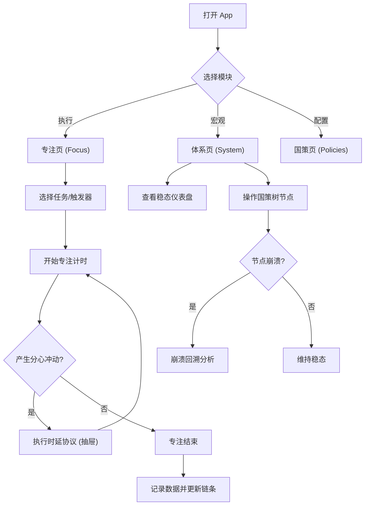

## 1. 产品概述
移动端本地优先的“专注记录 + 协议执行 + 复盘迭代”Web App
- 主要解决用户启动困难、中途放弃、破窗效应等自制力问题，通过神圣座位、时延协议（CTDP）和递归稳态迭代协议（RSIP）重构个人行为系统。
- 帮助用户建立从单点专注到全局生活状态的系统性重建。

## 2. 核心功能
### 2.1 功能模块
1. **专注页 (Focus)**: 极简全屏专注计时器、时延协议按钮（“我想分心了”）、专注链条展示
2. **体系页 (System)**: 稳态仪表盘、定式树/国策树画布
3. **国策页 (Policies)**: 国策模板库、自定义国策列表 (IF-THEN 逻辑)
4. **我的页 (Profile)**: 周报与崩溃回溯历史、数据导入导出、系统设置

### 2.2 页面详细描述
| 页面名称 | 模块名称 | 功能描述 |
|-----------|-------------|---------------------|
| 专注页 | 专注会话 | 选择任务、一键开始极简计时，记录时间与质量 |
| 专注页 | 时延协议 | 抽屉式弹窗记录“想分心”冲动，执行时延等待 |
| 专注页 | 专注链条 | 连续成功的专注链条可视化及断链逻辑 |
| 体系页 | 稳态仪表盘 | 系统稳态指数、连续天数、“农村包围城市”进度 |
| 体系页 | 国策树编辑器 | 可交互无级缩放树状图，节点状态（点亮/崩溃）联动 |
| 国策页 | 国策库 | 内置模板与自定义 IF-THEN 触发器与动作设置 |
| 我的页 | 数据与设置 | CTDP 周报、数据导入/导出 (JSON/CSV) |

## 3. 核心流程
用户启动 App，进入专注页开始一个专注会话。若产生分心冲动，执行时延协议。专注结束后记录质量。同时，用户在国策页配置日常习惯，在体系页查看整体系统的稳态与国策树，若节点崩溃则触发回溯复盘。

## 4. 用户界面设计
### 4.1 设计风格
- 整体风格：极简主义 iOS 风格（Apple 风格，大圆角，清晰的视觉层次）
- 交互手势：减少跳转，多用底部下拉抽屉 (Bottom Sheet)、滑动操作
- 动效：轻微且有意义的动画（如节点点亮的呼吸灯，崩溃的震动）
- 字体：系统默认无衬线字体，字号克制（Caption/Title分明）
- 颜色：单色中性色（如 Zinc/Slate）为主，辅以状态色（绿色代表点亮/成功，红色代表崩溃/警告）

### 4.2 页面设计概览
| 页面名称 | 模块名称 | UI 元素 |
|-----------|-------------|-------------|
| 专注页 | 极简计时器 | 巨大的倒计时数字，深色模式适配，极简控制按钮 |
| 专注页 | 时延抽屉 | 毛玻璃效果背景，滑块选择冲动强度，倒计时环 |
| 体系页 | 稳态仪表盘 | 环形进度条，锁屏小组件风格卡片 |
| 体系页 | 定式树画布 | 支持捏合缩放的节点连线图，不同状态节点有不同视觉反馈 |

### 4.3 响应式设计
- 移动端优先 (Mobile-first)，全屏体验，优化手指触控区域
- 支持 PWA 添加至桌面，隐藏浏览器导航栏
