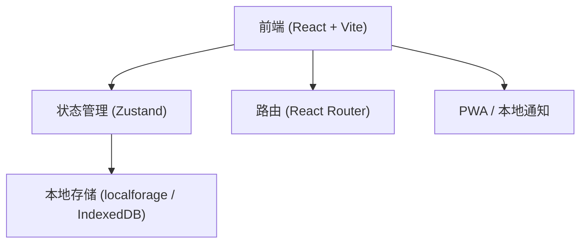
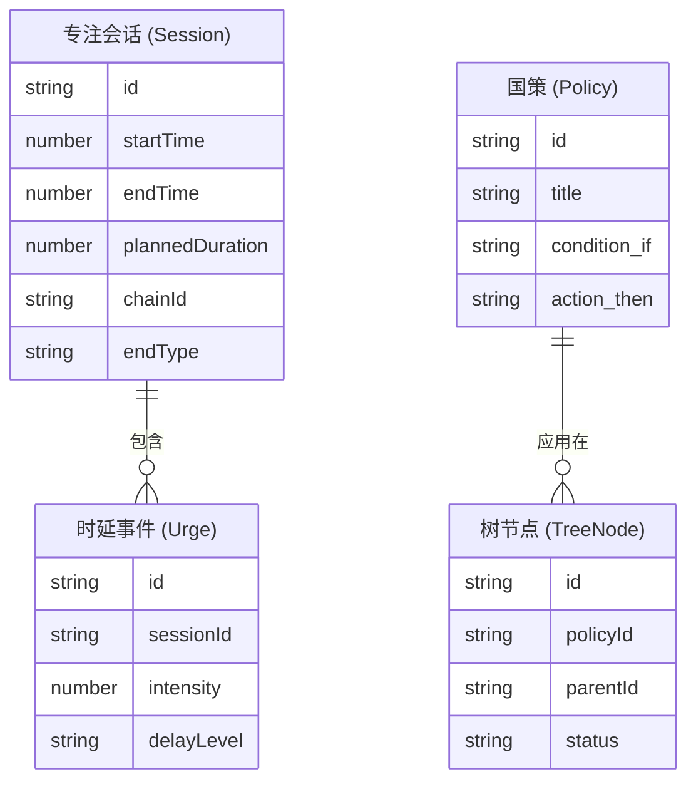

## 1. 架构设计

## 2. 技术栈说明
- 前端框架：React@18 + TypeScript + Vite
- 样式方案：Tailwind CSS + Lucide React (图标)
- 状态管理：Zustand
- 本地存储：localforage (封装 IndexedDB)
- 拖拽/树状图：React Flow (用于定式树)
- 组件库辅助：Radix UI 原语或纯手写 Tailwind，配合 Framer Motion (动效)
- 初始化工具：vite-init
- 动画库：Framer Motion

## 3. 路由定义
| 路由 | 用途 |
|-------|---------|
| / | 专注页 (Tab 1: Focus) - 默认首页 |
| /system | 体系页 (Tab 2: System) |
| /policies | 国策页 (Tab 3: Policies) |
| /profile | 我的页 (Tab 4: Profile) |

## 4. 数据模型 (Data Model)
### 4.1 实体关系图

## 5. 本地存储方案
使用 localforage 存储 JSON 对象：
- `sessions`: 专注记录列表
- `urges`: 冲动时延记录列表
- `policies`: 自定义与内置国策
- `tree_nodes`: 国策树节点状态及层级关系
- `settings`: 用户设置及链条规则
